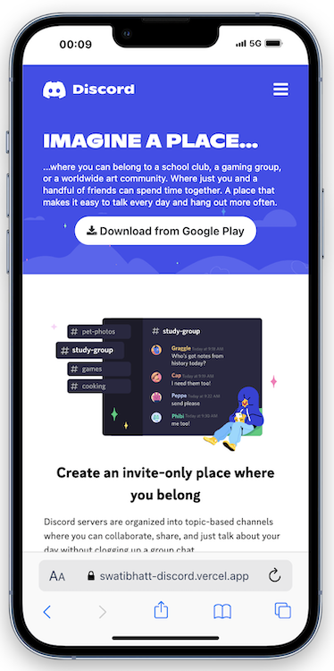
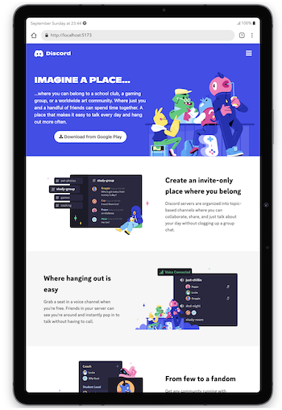
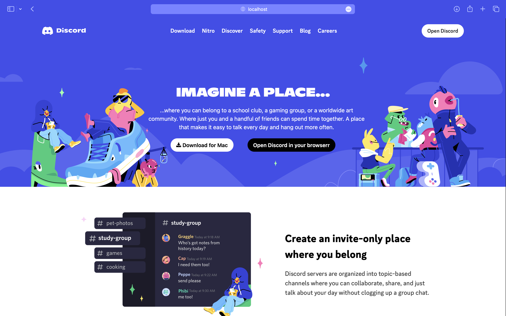

# Hii, I'm Swati Bhatt👩🏻‍💻!

# Discord Clone 🎭

<!-- change 2 discription-->
This project is a Discord clone built using HTML, CSS, and Tailwind CSS. 

It aims to replicate the  front-end user-interface of Discord-Web, including the layout and styling.

[Visit Now🚀](https://swatibhatt-discord.vercel.app/)

##  ☞Tech Stack Used 🖇️

##  ☞Sneak Peak 🫣

##  ☞Features🧐
- Responsive Design: Optimized for desktop, tablet, and mobile devices.
- Tailwind CSS: Utility-first CSS framework used for rapid UI development.
- Hero Section: Features call-to-action buttons and eye-catching imagery.
- Multi-Section Layout: Organized content sections that mimic Discord's front page.
- Footer with Links: Includes navigation to various product, company, and policy sections.

##  ☞Feedback✍🏻
I’d love to hear your thoughts on this project and would really appreciate any suggestions you have. Please feel free to reach out to me at:
get.swatibhatt@gmail.com

##  ☞Contact Me 📩
 

